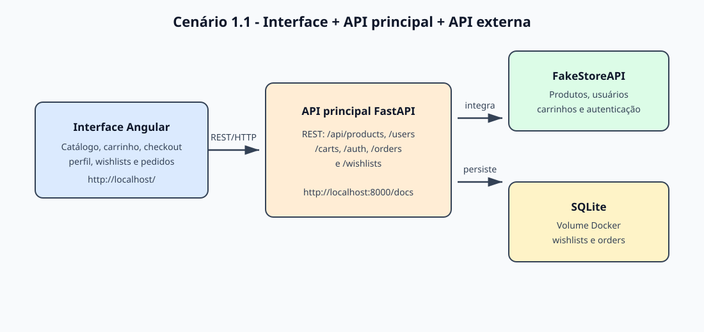

# Interface Back Avançado PUC3

Aplicação web de e-commerce desenvolvida com Angular 21 para consumir a API principal do projeto. A interface oferece catálogo de produtos, detalhes, carrinho, checkout, perfil do usuário, lista de desejos e histórico de pedidos, com integração ao backend local e ao serviço externo FakeStoreAPI.

---

## 🚀 Visão geral

Este repositório representa a camada de front-end do MVP. Ele se comunica com a API principal em FastAPI para:

- consultar e visualizar produtos;
- gerenciar o carrinho de compras;
- acessar e atualizar perfil do usuário;
- manipular listas de desejos; (funcionalidade nova)
- criar e acompanhar pedidos; (funcionalidade nova)
- exibir a documentação e o contrato da API em um ambiente integrado.

A arquitetura do projeto segue o cenário no qual a interface conversa com a API principal em HTTP/REST, e essa API realiza a integração com o catálogo externo.



---

## 🧰 Requisitos

Antes de iniciar, verifique se o ambiente local atende aos requisitos abaixo:

- Git
- Node.js 20+
- npm 10+
- Docker e Docker Compose
- Os dois repositórios clonados no mesmo diretório:
  - `interface-back-avancado-puc3` (este repositório)
  - `api-back-avancado-puc3` (API principal)

---

## 📦 Clonando os repositórios

A estrutura recomendada é a seguinte:

```bash
cd ~/github

git clone https://github.com/vinicius-lamberti/interface-back-avancado-puc3.git
git clone https://github.com/vinicius-lamberti/api-back-avancado-puc3.git
```

Em seguida, entre na pasta do frontend:

```bash
cd interface-back-avancado-puc3
```

---

## 🐳 Executando com Docker Compose (Opção 1)

Este é o fluxo recomendado para subir a stack completa do projeto.

Na raiz do repositório da interface, execute:

```bash
sudo docker-compose up --build
```

### Acesso aos serviços

- Aplicação frontend: http://localhost/
- Swagger da API: http://localhost:8000/docs

Para encerrar os containers:

```bash
sudo docker-compose down
```

### Serviços e portas

| Serviço | Porta local | Função |
| --- | ---: | --- |
| `frontend` | `80` | Interface Angular servida pelo Nginx |
| `backend` | `8000` | API FastAPI e documentação Swagger |
| `sqlite_data` | Não exposta | Volume persistente do SQLite |

---

## ⚙️ Configuração do ambiente local (Opção 2)

### 1. Instalar dependências

```bash
npm install
```

### 2. Verificar se a API principal está disponível

A aplicação depende da API backend em execução em:

```text
http://localhost:8000
```

Caso a API ainda não esteja rodando, siga as instruções do repositório da API antes de iniciar o frontend.

---

## ▶️ Executando o frontend localmente

### Modo de desenvolvimento

```bash
npm start
```

A interface ficará disponível em:

- http://localhost:4200

> O backend precisa estar operando em `http://localhost:8000` para que as rotas funcionem corretamente.

### Comandos úteis

```bash
npm run build
npm test
npm run watch
```

- `npm run build`: gera a build de produção em `dist/`
- `npm test`: executa os testes unitários
- `npm run watch`: compila em modo observação para desenvolvimento

---

## 🗂️ Estrutura principal do projeto

```text
interface-back-avancado-puc3/
├── src/
├── public/
├── docs/
├── angular.json
├── package.json
├── docker-compose.yml
├── Dockerfile
├── README.md
├── tsconfig.json
├── tsconfig.app.json
├── tsconfig.spec.json
└── .gitignore
```

Diretórios importantes:

- `src/app`: componentes, rotas, serviços e recursos da interface;
- `src/app/features`: módulos funcionais do projeto, como produto, carrinho, checkout, perfil, wishlist e pedidos;
- `src/app/services`: integrações com a API principal;
- `docs/`: materiais de apoio, incluindo o fluxograma da arquitetura.

---

## 🌐 API principal e API externa

O frontend usa a API principal em:

```text
http://localhost:8000
```

A documentação completa da API, incluindo schemas e testes manuais, está disponível em:

- http://localhost:8000/docs

### Rotas principais consumidas pela interface

| Método | Rota | Uso |
| --- | --- | --- |
| `GET` | `/products` e `/products/{id}` | Catálogo e detalhes do produto |
| `GET` | `/users/{id}` | Perfil do usuário |
| `POST` | `/users` | Criação de usuário |
| `PUT` | `/users/{id}` | Atualização do perfil |
| `GET` | `/carts` e `/carts/{id}` | Carrinho de compras |
| `POST` | `/orders` | Criação do pedido no checkout |
| `GET` | `/orders/user/{user_id}` | Histórico de pedidos |
| `GET` | `/wishlists/{user_id}` | Lista de desejos do usuário |
| `POST` | `/wishlists` | Criação de wishlist |
| `DELETE` | `/wishlists/{wishlist_id}` | Remoção da wishlist |

### API externa de referência

A API externa de referência é a [FakeStoreAPI](https://fakestoreapi.com/), utilizada como base para catálogo e dados de e-commerce.

- **Cadastro:** normalmente não é necessário para uso público de leitura em ambiente de prototipagem.
- **Licença:** a FakeStoreAPI é uma API pública de demonstração; a licença oficial deve ser verificada no site do serviço.
- **Finalidade:** catálogo de produtos, usuários e carrinhos para prototipagem e testes.

---

## 🧭 Rotas da interface

A navegação principal do frontend inclui:

- `/`: catálogo e busca de produtos
- `/product/:id`: detalhes do produto
- `/cart`: carrinho de compras
- `/checkout/success`: confirmação do pedido
- `/profile`: perfil do usuário
- `/wishlist/:id`: lista de desejos
- `/orders`: pedidos do usuário

---

## 🛠️ Troubleshooting (Resolução de Problemas)

### Erro: `KeyError: 'ContainerConfig'` ou erros de versão/incompatibilidade

Se o comando de inicialização falhar ao recriar os containers ou mostrar erros internos do Docker, siga os passos abaixo para limpar o ambiente e forçar uma reconstrução limpa.

**1. Limpeza manual extrema**

Execute o comando abaixo para parar os containers, remover orfãos, limpar volumes e remover cache corrompido:

```bash
sudo docker-compose down --volumes --remove-orphans && sudo docker builder prune -f
```

**2. Recompor os serviços**

Após a limpeza, recrie todas as imagens e containers do zero:

```bash
sudo docker-compose up --build --force-recreate
```

> A opção `--volumes` remove o volume do SQLite, eliminando os dados persistidos locais do projeto.

---

## 📌 Observações finais

- O projeto foi desenvolvido com foco em angular e em integração com a API principal em FastAPI.
- O fluxo recomendado de execução é via Docker Compose para manter o ambiente consistente entre frontend e backend.
- A API principal fornece a documentação oficial em Swagger e é o ponto de integração central da aplicação.

---

## 📄 Licença

Este projeto é acadêmico e não define uma licença de distribuição exclusiva. As bibliotecas e serviços utilizados, como Angular, FastAPI, Docker e FakeStoreAPI, permanecem sujeitos às respectivas licenças e termos oficiais.
